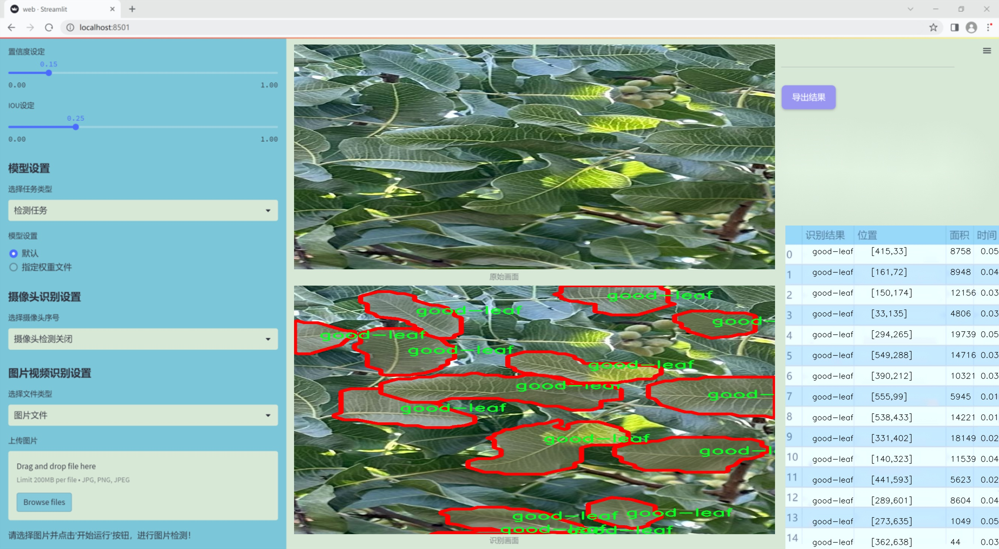
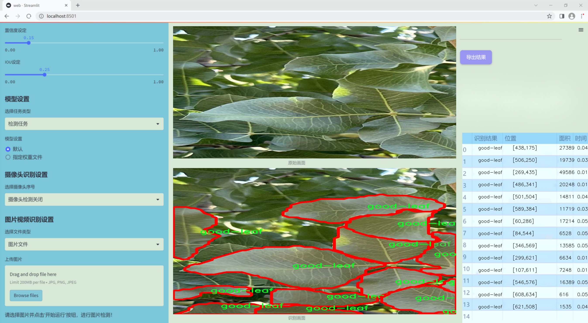
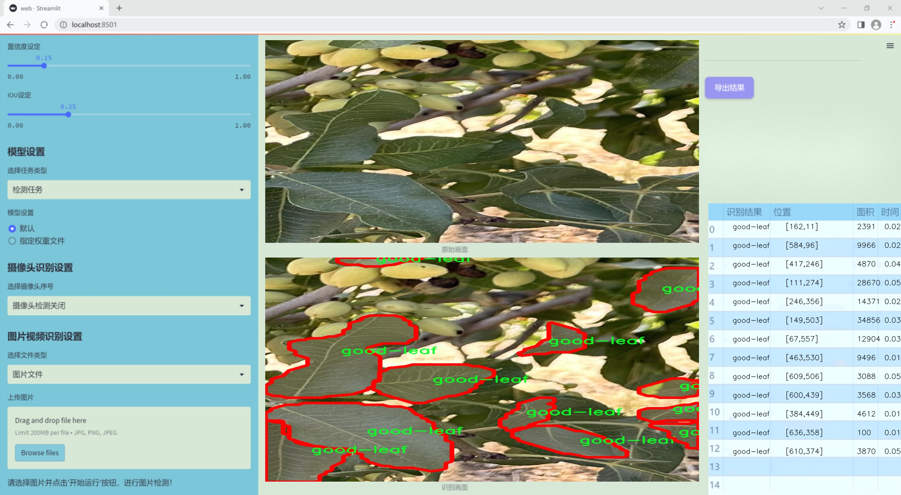
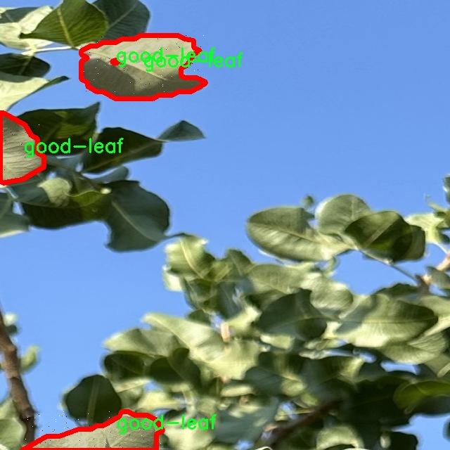
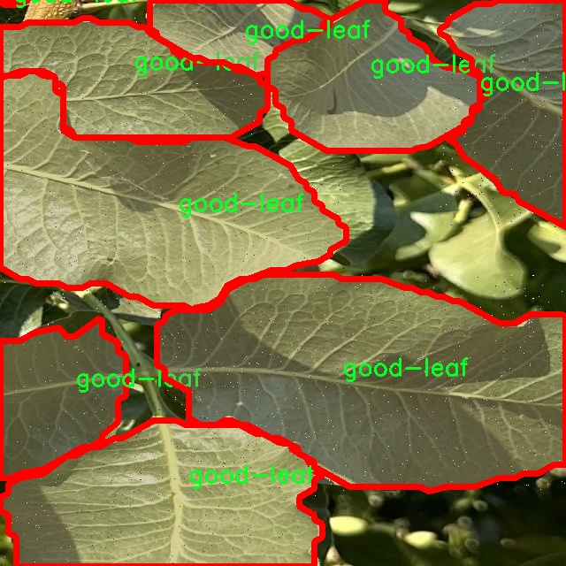
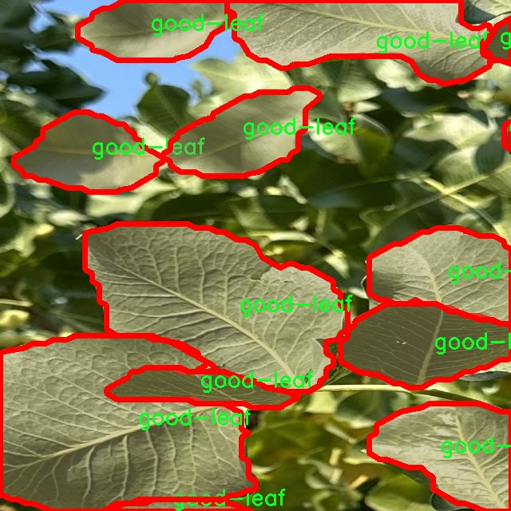
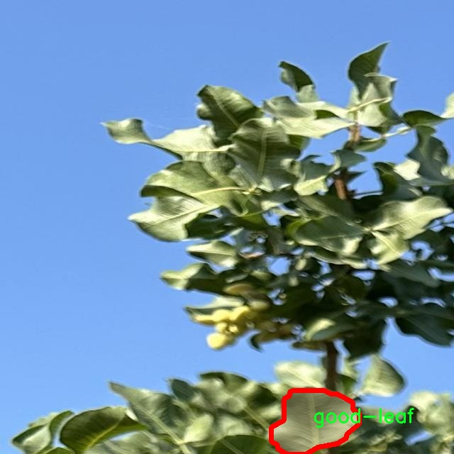
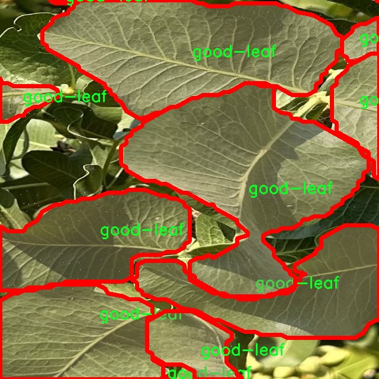

### 1.背景意义

### 研究背景与意义

随着全球农业生产的不断发展，作物病害的监测与管理成为了提高农业产量和质量的重要环节。开心果作为一种高经济价值的坚果，其种植面积逐年扩大，然而，叶片病害的发生严重影响了开心果的生长和产量。因此，开发高效的叶片分割与识别系统，对于及时发现和处理病害具有重要的实际意义。传统的人工检测方法不仅耗时耗力，而且容易受到主观因素的影响，难以保证检测的准确性和一致性。

近年来，深度学习技术在计算机视觉领域取得了显著进展，尤其是目标检测和图像分割任务中，基于卷积神经网络（CNN）的模型如YOLO（You Only Look Once）系列在实时性和准确性方面表现出色。YOLOv11作为YOLO系列的最新版本，进一步提升了模型的性能，能够更好地处理复杂的图像分割任务。因此，基于改进YOLOv11的开心果叶片分割系统的研究，旨在利用深度学习技术，自动化地识别和分割开心果叶片，尤其是良好叶片的特征。

本研究将使用一个包含2700张图像的数据集，专注于“good-leaf”这一类别，通过对图像进行标注和处理，构建一个高效的叶片分割模型。该模型不仅能够提高叶片检测的准确性，还能为后续的病害分析提供基础数据支持。通过引入先进的深度学习技术，期望能够实现对开心果叶片的实时监测，帮助农民及时采取措施，从而提高开心果的产量和质量，推动农业的可持续发展。

### 2.视频效果

[2.1 视频效果](https://www.bilibili.com/video/BV18NkwYiEEo/)

### 3.图片效果







##### [项目涉及的源码数据来源链接](https://kdocs.cn/l/cszuIiCKVNis)**

注意：本项目提供训练的数据集和训练教程,由于版本持续更新,暂不提供权重文件（best.pt）,请按照6.训练教程进行训练后实现上图演示的效果。

### 4.数据集信息

##### 4.1 本项目数据集类别数＆类别名

nc: 1
names: ['good-leaf']


该项目为【图像分割】数据集，请在【训练教程和Web端加载模型教程（第三步）】这一步的时候按照【图像分割】部分的教程来训练

##### 4.2 本项目数据集信息介绍

本项目数据集信息介绍

本项目所使用的数据集名为“Pistachio-leaf-segmentation-2024”，旨在为改进YOLOv11的开心果叶片分割系统提供强有力的支持。该数据集专注于开心果叶片的图像处理与分析，尤其是对健康叶片的精准分割。数据集中包含了大量高质量的图像，这些图像均经过精心挑选和标注，以确保其在训练深度学习模型时的有效性和准确性。

在数据集的类别设置上，采用了单一类别的设计，类别名称为“good-leaf”。这一设计旨在聚焦于健康的开心果叶片，便于模型在训练过程中能够专注于识别和分割出最佳的叶片特征。通过对“good-leaf”这一类别的深入学习，模型将能够更好地理解健康叶片的形态、纹理和颜色特征，从而提高分割的精度和效率。

数据集的构建过程注重多样性和代表性，涵盖了不同生长阶段、不同光照条件和不同背景下的开心果叶片图像。这种多样性不仅增强了模型的泛化能力，还能有效应对实际应用中可能遇到的各种挑战。此外，数据集中的图像均为高分辨率，确保了细节的清晰可辨，为后续的图像处理和分析提供了良好的基础。

通过使用“Pistachio-leaf-segmentation-2024”数据集，我们期望能够训练出一个更加精准和高效的YOLOv11模型，从而在开心果叶片的自动化分割任务中取得显著进展。这一数据集的成功应用将为农业智能化管理提供重要的技术支持，推动开心果种植行业的可持续发展。











### 5.全套项目环境部署视频教程（零基础手把手教学）

[5.1 所需软件PyCharm和Anaconda安装教程（第一步）](https://www.bilibili.com/video/BV1BoC1YCEKi/?spm_id_from=333.999.0.0&vd_source=bc9aec86d164b67a7004b996143742dc)


[5.2 安装Python虚拟环境创建和依赖库安装视频教程（第二步）](https://www.bilibili.com/video/BV1ZoC1YCEBw?spm_id_from=333.788.videopod.sections&vd_source=bc9aec86d164b67a7004b996143742dc)

### 6.改进YOLOv11训练教程和Web_UI前端加载模型教程（零基础手把手教学）

[6.1 改进YOLOv11训练教程和Web_UI前端加载模型教程（第三步）](https://www.bilibili.com/video/BV1BoC1YCEhR?spm_id_from=333.788.videopod.sections&vd_source=bc9aec86d164b67a7004b996143742dc)


按照上面的训练视频教程链接加载项目提供的数据集，运行train.py即可开始训练



     Epoch   gpu_mem       box       obj       cls    labels  img_size
     1/200     20.8G   0.01576   0.01955  0.007536        22      1280: 100%|██████████| 849/849 [14:42<00:00,  1.04s/it]
               Class     Images     Labels          P          R     mAP@.5 mAP@.5:.95: 100%|██████████| 213/213 [01:14<00:00,  2.87it/s]
                 all       3395      17314      0.994      0.957      0.0957      0.0843

     Epoch   gpu_mem       box       obj       cls    labels  img_size
     2/200     20.8G   0.01578   0.01923  0.007006        22      1280: 100%|██████████| 849/849 [14:44<00:00,  1.04s/it]
               Class     Images     Labels          P          R     mAP@.5 mAP@.5:.95: 100%|██████████| 213/213 [01:12<00:00,  2.95it/s]
                 all       3395      17314      0.996      0.956      0.0957      0.0845

     Epoch   gpu_mem       box       obj       cls    labels  img_size
     3/200     20.8G   0.01561    0.0191  0.006895        27      1280: 100%|██████████| 849/849 [10:56<00:00,  1.29it/s]
               Class     Images     Labels          P          R     mAP@.5 mAP@.5:.95: 100%|███████   | 187/213 [00:52<00:00,  4.04it/s]
                 all       3395      17314      0.996      0.957      0.0957      0.0845


###### [项目数据集下载链接](https://kdocs.cn/l/cszuIiCKVNis)

### 7.原始YOLOv11算法讲解


##### YOLO11介绍

Ultralytics YOLO11是一款尖端的、最先进的模型，它在之前YOLO版本成功的基础上进行了构建，并引入了新功能和改进，以进一步提升性能和灵活性。
**YOLO11设计快速、准确且易于使用，使其成为各种物体检测和跟踪、实例分割、图像分类以及姿态估计任务的绝佳选择。**


**结构图如下：**


##### **C3k2**

**C3k2，结构图如下**


**C3k2，继承自类`C2f，其中通过c3k设置False或者Ture来决定选择使用C3k还是`**Bottleneck


**实现代码** **ultralytics/nn/modules/block.py**

##### C2PSA介绍

**借鉴V10 PSA结构，实现了C2PSA和C2fPSA，最终选择了基于C2的C2PSA（可能涨点更好？）**


**实现代码** **ultralytics/nn/modules/block.py**

##### Detect介绍

**分类检测头引入了DWConv（更加轻量级，为后续二次创新提供了改进点），结构图如下（和V8的区别）：**


### 8.200+种全套改进YOLOV11创新点原理讲解

#### 8.1 200+种全套改进YOLOV11创新点原理讲解大全

由于篇幅限制，每个创新点的具体原理讲解就不全部展开，具体见下列网址中的改进模块对应项目的技术原理博客网址【Blog】（创新点均为模块化搭建，原理适配YOLOv5~YOLOv11等各种版本）

[改进模块技术原理博客【Blog】网址链接](https://gitee.com/qunmasj/good)


#### 8.2 精选部分改进YOLOV11创新点原理讲解

###### 这里节选部分改进创新点展开原理讲解(完整的改进原理见上图和[改进模块技术原理博客链接](https://gitee.com/qunmasj/good)【如果此小节的图加载失败可以通过CSDN或者Github搜索该博客的标题访问原始博客，原始博客图片显示正常】
### RepViT简介

近年来，与轻量级卷积神经网络(cnn)相比，轻量级视觉变压器(ViTs)在资源受限的移动设备上表现出了更高的性能和更低的延迟。这种改进通常归功于多头自注意模块，它使模型能够学习全局表示。然而，轻量级vit和轻量级cnn之间的架构差异还没有得到充分的研究。在这项研究中，我们重新审视了轻量级cnn的高效设计，并强调了它们在移动设备上的潜力。通过集成轻量级vit的高效架构选择，我们逐步增强了标准轻量级CNN的移动友好性，特别是MobileNetV3。这就产生了一个新的纯轻量级cnn家族，即RepViT。大量的实验表明，RepViT优于现有的轻型vit，并在各种视觉任务中表现出良好的延迟。在ImageNet上，RepViT在iPhone 12上以近1ms的延迟实现了超过80%的top-1精度，据我们所知，这是轻量级模型的第一次。

#### RepViT简介
轻量级模型研究一直是计算机视觉任务中的一个焦点，其目标是在降低计算成本的同时达到优秀的性能。轻量级模型与资源受限的移动设备尤其相关，使得视觉模型的边缘部署成为可能。在过去十年中，研究人员主要关注轻量级卷积神经网络（CNNs）的设计，提出了许多高效的设计原则，包括可分离卷积 、逆瓶颈结构 、通道打乱 和结构重参数化等，产生了 MobileNets ，ShuffleNets和 RepVGG 等代表性模型。

另一方面，视觉 Transformers（ViTs）成为学习视觉表征的另一种高效方案。与 CNNs 相比，ViTs 在各种计算机视觉任务中表现出了更优越的性能。然而，ViT 模型一般尺寸很大，延迟很高，不适合资源受限的移动设备。因此，研究人员开始探索 ViT 的轻量级设计。许多高效的ViTs设计原则被提出，大大提高了移动设备上 ViTs 的计算效率，产生了EfficientFormers ，MobileViTs等代表性模型。这些轻量级 ViTs 在移动设备上展现出了相比 CNNs 的更强的性能和更低的延迟。

轻量级 ViTs 优于轻量级 CNNs 的原因通常归结于多头注意力模块，该模块使模型能够学习全局表征。然而，轻量级 ViTs 和轻量级 CNNs 在块结构、宏观和微观架构设计方面存在值得注意的差异，但这些差异尚未得到充分研究。这自然引出了一个问题：轻量级 ViTs 的架构选择能否提高轻量级 CNN 的性能？在这项工作中，我们结合轻量级 ViTs 的架构选择，重新审视了轻量级 CNNs 的设计。我们的旨在缩小轻量级 CNNs 与轻量级 ViTs 之间的差距，并强调前者与后者相比在移动设备上的应用潜力。


在 ConvNeXt 中，参考该博客提出的基于 ResNet50 架构的基础上通过严谨的理论和实验分析，最终设计出一个非常优异的足以媲美 Swin-Transformer 的纯卷积神经网络架构。同样地，RepViT也是主要通过将轻量级 ViTs 的架构设计逐步整合到标准轻量级 CNN，即MobileNetV3-L，来对其进行针对性地改造（魔改）。在这个过程中，作者们考虑了不同粒度级别的设计元素，并通过一系列步骤达到优化的目标。


详细优化步骤如下：

#### 训练配方的对齐
论文中引入了一种衡量移动设备上延迟的指标，并将训练策略与现有的轻量级 ViTs 对齐。这一步骤主要是为了确保模型训练的一致性，其涉及两个概念，即延迟度量和训练策略的调整。

#### 延迟度量指标
为了更准确地衡量模型在真实移动设备上的性能，作者选择了直接测量模型在设备上的实际延迟，以此作为基准度量。这个度量方法不同于之前的研究，它们主要通过FLOPs或模型大小等指标优化模型的推理速度，这些指标并不总能很好地反映在移动应用中的实际延迟。

#### 训练策略的对齐
这里，将 MobileNetV3-L 的训练策略调整以与其他轻量级 ViTs 模型对齐。这包括使用 AdamW 优化器-ViTs 模型必备的优化器，进行 5 个 epoch 的预热训练，以及使用余弦退火学习率调度进行 300 个 epoch 的训练。尽管这种调整导致了模型准确率的略微下降，但可以保证公平性。

#### 块设计的优化
基于一致的训练设置，作者们探索了最优的块设计。块设计是 CNN 架构中的一个重要组成部分，优化块设计有助于提高网络的性能。

#### 分离 Token 混合器和通道混合器
这块主要是对 MobileNetV3-L 的块结构进行了改进，分离了令牌混合器和通道混合器。原来的 MobileNetV3 块结构包含一个 1x1 扩张卷积，然后是一个深度卷积和一个 1x1 的投影层，然后通过残差连接连接输入和输出。在此基础上，RepViT 将深度卷积提前，使得通道混合器和令牌混合器能够被分开。为了提高性能，还引入了结构重参数化来在训练时为深度滤波器引入多分支拓扑。最终，作者们成功地在 MobileNetV3 块中分离了令牌混合器和通道混合器，并将这种块命名为 RepViT 块。

#### 降低扩张比例并增加宽度
在通道混合器中，原本的扩张比例是 4，这意味着 MLP 块的隐藏维度是输入维度的四倍，消耗了大量的计算资源，对推理时间有很大的影响。为了缓解这个问题，我们可以将扩张比例降低到 2，从而减少了参数冗余和延迟，使得 MobileNetV3-L 的延迟降低到 0.65ms。随后，通过增加网络的宽度，即增加各阶段的通道数量，Top-1 准确率提高到 73.5%，而延迟只增加到 0.89ms！

#### 宏观架构元素的优化
在这一步，本文进一步优化了MobileNetV3-L在移动设备上的性能，主要是从宏观架构元素出发，包括 stem，降采样层，分类器以及整体阶段比例。通过优化这些宏观架构元素，模型的性能可以得到显著提高。

#### 浅层网络使用卷积提取器
ViTs 通常使用一个将输入图像分割成非重叠补丁的 “patchify” 操作作为 stem。然而，这种方法在训练优化性和对训练配方的敏感性上存在问题。因此，作者们采用了早期卷积来代替，这种方法已经被许多轻量级 ViTs 所采纳。对比之下，MobileNetV3-L 使用了一个更复杂的 stem 进行 4x 下采样。这样一来，虽然滤波器的初始数量增加到24，但总的延迟降低到0.86ms，同时 top-1 准确率提高到 73.9%。

#### 更深的下采样层
在 ViTs 中，空间下采样通常通过一个单独的补丁合并层来实现。因此这里我们可以采用一个单独和更深的下采样层，以增加网络深度并减少由于分辨率降低带来的信息损失。具体地，作者们首先使用一个 1x1 卷积来调整通道维度，然后将两个 1x1 卷积的输入和输出通过残差连接，形成一个前馈网络。此外，他们还在前面增加了一个 RepViT 块以进一步加深下采样层，这一步提高了 top-1 准确率到 75.4%，同时延迟为 0.96ms。

#### 更简单的分类器
在轻量级 ViTs 中，分类器通常由一个全局平均池化层后跟一个线性层组成。相比之下，MobileNetV3-L 使用了一个更复杂的分类器。因为现在最后的阶段有更多的通道，所以作者们将它替换为一个简单的分类器，即一个全局平均池化层和一个线性层，这一步将延迟降低到 0.77ms，同时 top-1 准确率为 74.8%。

#### 整体阶段比例
阶段比例代表了不同阶段中块数量的比例，从而表示了计算在各阶段中的分布。论文选择了一个更优的阶段比例 1:1:7:1，然后增加网络深度到 2:2:14:2，从而实现了一个更深的布局。这一步将 top-1 准确率提高到 76.9%，同时延迟为 1.02 ms。

#### 卷积核大小的选择
众所周知，CNNs 的性能和延迟通常受到卷积核大小的影响。例如，为了建模像 MHSA 这样的远距离上下文依赖，ConvNeXt 使用了大卷积核，从而实现了显著的性能提升。然而，大卷积核对于移动设备并不友好，因为它的计算复杂性和内存访问成本。MobileNetV3-L 主要使用 3x3 的卷积，有一部分块中使用 5x5 的卷积。作者们将它们替换为3x3的卷积，这导致延迟降低到 1.00ms，同时保持了76.9%的top-1准确率。

#### SE 层的位置
自注意力模块相对于卷积的一个优点是根据输入调整权重的能力，这被称为数据驱动属性。作为一个通道注意力模块，SE层可以弥补卷积在缺乏数据驱动属性上的限制，从而带来更好的性能。MobileNetV3-L 在某些块中加入了SE层，主要集中在后两个阶段。然而，与分辨率较高的阶段相比，分辨率较低的阶段从SE提供的全局平均池化操作中获得的准确率提升较小。作者们设计了一种策略，在所有阶段以交叉块的方式使用SE层，从而在最小的延迟增量下最大化准确率的提升，这一步将top-1准确率提升到77.4%，同时延迟降低到0.87ms。

注意！【这一点其实百度在很早前就已经做过实验比对得到过这个结论了，SE 层放置在靠近深层的地方效果好】

#### 微观设计的调整
RepViT 通过逐层微观设计来调整轻量级 CNN，这包括选择合适的卷积核大小和优化挤压-激励（Squeeze-and-excitation，简称SE）层的位置。这两种方法都能显著改善模型性能。

#### 网络架构
最终，通过整合上述改进策略，我们便得到了模型RepViT的整体架构，该模型有多个变种，例如RepViT-M1/M2/M3。同样地，不同的变种主要通过每个阶段的通道数和块数来区分。


### 9.系统功能展示

图9.1.系统支持检测结果表格显示

  图9.2.系统支持置信度和IOU阈值手动调节

  图9.3.系统支持自定义加载权重文件best.pt(需要你通过步骤5中训练获得)

  图9.4.系统支持摄像头实时识别

  图9.5.系统支持图片识别

  图9.6.系统支持视频识别

  图9.7.系统支持识别结果文件自动保存

  图9.8.系统支持Excel导出检测结果数据


### 10. YOLOv11核心改进源码讲解

#### 10.1 pkinet.py

以下是经过简化和注释的核心代码部分，保留了主要的类和函数，并对其进行了详细的中文注释：

```python
import math
import torch
import torch.nn as nn
from typing import Optional, Union, Sequence

# 定义随机丢弃路径的函数
def drop_path(x: torch.Tensor, drop_prob: float = 0., training: bool = False) -> torch.Tensor:
    """在残差块的主路径中随机丢弃路径（随机深度）。
    
    参数:
        x (torch.Tensor): 输入张量。
        drop_prob (float): 丢弃的概率。默认值为0。
        training (bool): 是否在训练模式下。默认值为False。
    
    返回:
        torch.Tensor: 处理后的张量。
    """
    if drop_prob == 0. or not training:
        return x  # 如果不丢弃，直接返回输入
    keep_prob = 1 - drop_prob
    shape = (x.shape[0], ) + (1, ) * (x.ndim - 1)  # 生成与输入相同的形状
    random_tensor = keep_prob + torch.rand(shape, dtype=x.dtype, device=x.device)
    output = x.div(keep_prob) * random_tensor.floor()  # 应用丢弃
    return output

# 定义DropPath类
class DropPath(nn.Module):
    """随机丢弃路径的模块"""
    def __init__(self, drop_prob: float = 0.1):
        super().__init__()
        self.drop_prob = drop_prob  # 丢弃概率

    def forward(self, x: torch.Tensor) -> torch.Tensor:
        return drop_path(x, self.drop_prob, self.training)  # 前向传播

# 定义卷积前馈网络
class ConvFFN(nn.Module):
    """使用ConvModule实现的多层感知机"""
    def __init__(self, in_channels: int, out_channels: Optional[int] = None, hidden_channels_scale: float = 4.0):
        super().__init__()
        out_channels = out_channels or in_channels
        hidden_channels = int(in_channels * hidden_channels_scale)

        # 定义前馈网络的层
        self.ffn_layers = nn.Sequential(
            nn.LayerNorm(in_channels),  # 归一化
            nn.Conv2d(in_channels, hidden_channels, kernel_size=1),  # 1x1卷积
            nn.Conv2d(hidden_channels, hidden_channels, kernel_size=3, padding=1, groups=hidden_channels),  # 深度卷积
            nn.GELU(),  # 激活函数
            nn.Conv2d(hidden_channels, out_channels, kernel_size=1)  # 1x1卷积
        )

    def forward(self, x):
        return self.ffn_layers(x)  # 前向传播

# 定义主网络类
class PKINet(nn.Module):
    """多核卷积网络"""
    def __init__(self, arch: str = 'S'):
        super().__init__()
        self.stages = nn.ModuleList()  # 存储网络的各个阶段

        # 定义网络的结构
        if arch == 'S':
            self.stages.append(self._make_stage(3, 64))  # 添加第一个阶段
            self.stages.append(self._make_stage(64, 128))  # 添加第二个阶段
            # 可以继续添加更多阶段

    def _make_stage(self, in_channels: int, out_channels: int):
        """构建网络的一个阶段"""
        return nn.Sequential(
            nn.Conv2d(in_channels, out_channels, kernel_size=3, stride=2, padding=1),  # 卷积层
            nn.BatchNorm2d(out_channels),  # 批归一化
            nn.ReLU()  # 激活函数
        )

    def forward(self, x):
        for stage in self.stages:
            x = stage(x)  # 通过每个阶段
        return x  # 返回最终输出

# 定义网络的构造函数
def PKINET_S():
    return PKINet('S')  # 返回S版本的网络

if __name__ == '__main__':
    model = PKINET_S()  # 创建模型实例
    inputs = torch.randn((1, 3, 640, 640))  # 创建输入张量
    res = model(inputs)  # 进行前向传播
    print(res.size())  # 输出结果的尺寸
```

### 代码说明：
1. **drop_path**: 实现了随机丢弃路径的功能，适用于训练中的残差块。
2. **DropPath**: 封装了`drop_path`函数，作为一个可训练的模块。
3. **ConvFFN**: 实现了一个多层感知机，使用卷积层和激活函数进行特征提取。
4. **PKINet**: 主网络类，定义了网络的结构和前向传播逻辑。
5. **PKINET_S**: 构造函数，返回S版本的网络实例。

以上代码为核心功能部分，其他辅助函数和类可以根据需要进行扩展或修改。

该文件 `pkinet.py` 实现了一个名为 PKINet 的深度学习模型，主要用于图像处理任务。这个模型的结构灵感来源于 Inception 模块，结合了多种卷积核的使用，以增强特征提取能力。以下是对文件中各个部分的详细讲解。

首先，文件导入了一些必要的库，包括 `torch` 和 `torch.nn`，并尝试从其他模块中导入一些功能，例如 `ConvModule` 和 `BaseModule`，这些模块提供了构建卷积层和模型基类的功能。

接下来，定义了一个名为 `drop_path` 的函数，用于实现随机深度（Stochastic Depth）技术，这是一种在训练过程中随机丢弃某些路径的策略，以提高模型的泛化能力。`DropPath` 类则是对这个函数的封装，继承自 `nn.Module`，并在前向传播中调用 `drop_path` 函数。

`autopad` 函数用于自动计算卷积层的填充量，确保输出尺寸与输入尺寸相匹配。`make_divisible` 函数则用于确保通道数是某个指定值的倍数，这在构建网络时有助于优化计算效率。

文件中还定义了一些辅助类，如 `BCHW2BHWC` 和 `BHWC2BCHW`，用于在不同的张量维度之间进行转换，`GSiLU` 类实现了一种新的激活函数，即全局 Sigmoid 门控线性单元（Global Sigmoid-Gated Linear Unit）。

`CAA` 类实现了上下文锚点注意力机制，旨在增强模型对重要特征的关注。`ConvFFN` 类则实现了一个多层感知机，使用卷积模块来替代传统的全连接层。

`Stem` 和 `DownSamplingLayer` 类分别实现了模型的初始层和下采样层，前者用于处理输入图像，后者用于降低特征图的空间维度。`InceptionBottleneck` 类实现了带有 Inception 模块的瓶颈结构，结合了多种卷积核的使用。

`PKIBlock` 类是核心模块，结合了多个 Inception 模块和前馈网络，能够有效提取多尺度特征。`PKIStage` 类则是由多个 `PKIBlock` 组成的阶段，负责逐步处理特征图。

最后，`PKINet` 类是整个网络的封装，定义了网络的架构和前向传播过程。它支持多种不同的架构设置（如 T、S、B），并在初始化时根据指定的架构构建相应的层。

在文件的最后部分，定义了三个函数 `PKINET_T`、`PKINET_S` 和 `PKINET_B`，用于创建不同版本的 PKINet 模型。主程序部分则展示了如何实例化模型并进行一次前向传播。

整体来看，这个文件实现了一个复杂的深度学习模型，结合了多种先进的技术，旨在提高图像处理任务的性能。

#### 10.2 shiftwise_conv.py

以下是代码中最核心的部分，并附上详细的中文注释：

```python
import math
import torch
import torch.nn as nn
import torch.nn.functional as F

def get_conv2d(in_channels, out_channels, kernel_size, stride, padding, dilation, groups, bias):
    # 创建一个二维卷积层
    return nn.Conv2d(
        in_channels, out_channels, kernel_size, stride, padding, dilation, groups, bias
    )

def get_bn(channels):
    # 创建一个批归一化层
    return nn.BatchNorm2d(channels)

class Mask(nn.Module):
    def __init__(self, size):
        super().__init__()
        # 初始化权重参数，并在[-1, 1]之间均匀分布
        self.weight = torch.nn.Parameter(data=torch.Tensor(*size), requires_grad=True)
        self.weight.data.uniform_(-1, 1)

    def forward(self, x):
        # 使用sigmoid函数对权重进行归一化，并与输入x相乘
        w = torch.sigmoid(self.weight)
        masked_wt = w.mul(x)
        return masked_wt

class LoRAConvsByWeight(nn.Module):
    def __init__(self, in_channels, out_channels, big_kernel, small_kernel, stride=1, group=1, bn=True, use_small_conv=True):
        super().__init__()
        self.kernels = (small_kernel, big_kernel)  # 小卷积核和大卷积核
        self.stride = stride
        self.small_conv = use_small_conv
        padding, after_padding_index, index = self.shift(self.kernels)  # 计算填充
        self.pad = padding, after_padding_index, index
        self.nk = math.ceil(big_kernel / small_kernel)  # 计算需要的卷积核数量
        out_n = out_channels * self.nk  # 输出通道数
        self.split_convs = nn.Conv2d(in_channels, out_n, kernel_size=small_kernel, stride=stride, padding=padding, groups=group, bias=False)

        # 创建两个Mask实例
        self.lora1 = Mask((1, out_n, 1, 1))
        self.lora2 = Mask((1, out_n, 1, 1))
        self.use_bn = bn

        # 如果需要，创建批归一化层
        if bn:
            self.bn_lora1 = get_bn(out_channels)
            self.bn_lora2 = get_bn(out_channels)
        else:
            self.bn_lora1 = None
            self.bn_lora2 = None

    def forward(self, inputs):
        out = self.split_convs(inputs)  # 进行卷积操作
        *_, ori_h, ori_w = inputs.shape  # 获取输入的高度和宽度
        # 分别处理lora1和lora2的输出
        lora1_x = self.forward_lora(self.lora1(out), ori_h, ori_w, VH='H', bn=self.bn_lora1)
        lora2_x = self.forward_lora(self.lora2(out), ori_h, ori_w, VH='W', bn=self.bn_lora2)
        x = lora1_x + lora2_x  # 将两个输出相加
        return x

    def forward_lora(self, out, ori_h, ori_w, VH='H', bn=None):
        # 沿着每个组的索引进行数据重排
        b, c, h, w = out.shape
        out = torch.split(out.reshape(b, -1, self.nk, h, w), 1, 2)  # 将输出按组分割
        x = 0
        for i in range(self.nk):
            outi = self.rearrange_data(out[i], i, ori_h, ori_w, VH)  # 重排数据
            x = x + outi  # 累加
        if self.use_bn:
            x = bn(x)  # 如果需要，进行批归一化
        return x

    def rearrange_data(self, x, idx, ori_h, ori_w, VH):
        # 根据索引重排数据
        padding, _, index = self.pad
        x = x.squeeze(2)  # 去掉维度
        *_, h, w = x.shape
        k = min(self.kernels)
        ori_k = max(self.kernels)
        ori_p = ori_k // 2
        stride = self.stride
        # 计算填充和开始点
        if (idx + 1) >= index:
            pad_l = 0
            s = (idx + 1 - index) * (k // stride)
        else:
            pad_l = (index - 1 - idx) * (k // stride)
            s = 0
        if VH == 'H':
            suppose_len = (ori_w + 2 * ori_p - ori_k) // stride + 1
            pad_r = 0 if (s + suppose_len) <= (w + pad_l) else s + suppose_len - w - pad_l
            new_pad = (pad_l, pad_r, 0, 0)
            dim = 3
        else:
            suppose_len = (ori_h + 2 * ori_p - ori_k) // stride + 1
            pad_r = 0 if (s + suppose_len) <= (h + pad_l) else s + suppose_len - h - pad_l
            new_pad = (0, 0, pad_l, pad_r)
            dim = 2
        if len(set(new_pad)) > 1:
            x = F.pad(x, new_pad)  # 进行填充
        # 处理垂直或水平方向的填充
        if padding * 2 + 1 != k:
            pad = padding - k // 2
            if VH == 'H':
                x = torch.narrow(x, 2, pad, h - 2 * pad)
            else:
                x = torch.narrow(x, 3, pad, w - 2 * pad)

        xs = torch.narrow(x, dim, s, suppose_len)  # 根据计算的开始点和长度进行切片
        return xs

    def shift(self, kernels):
        # 计算填充和窗口索引
        mink, maxk = min(kernels), max(kernels)
        mid_p = maxk // 2
        offset_idx_left = mid_p % mink
        offset_idx_right = (math.ceil(maxk / mink) * mink - mid_p - 1) % mink
        padding = offset_idx_left % mink
        while padding < offset_idx_right:
            padding += mink
        while padding < (mink - 1):
            padding += mink
        after_padding_index = padding - offset_idx_left
        index = math.ceil((mid_p + 1) / mink)
        real_start_idx = index - after_padding_index // mink
        return padding, after_padding_index, real_start_idx

class ReparamLargeKernelConv(nn.Module):
    def __init__(self, in_channels, out_channels, kernel_size, small_kernel=5, stride=1, groups=1, small_kernel_merged=False, Decom=True, bn=True):
        super(ReparamLargeKernelConv, self).__init__()
        self.kernel_size = kernel_size
        self.small_kernel = small_kernel
        self.Decom = Decom
        padding = kernel_size // 2  # 计算填充
        if small_kernel_merged:
            self.lkb_reparam = get_conv2d(in_channels, out_channels, kernel_size, stride, padding, 1, groups, True)
        else:
            if self.Decom:
                self.LoRA = conv_bn(in_channels, out_channels, (kernel_size, small_kernel), stride, padding, groups, bn=bn)
            else:
                self.lkb_origin = conv_bn(in_channels, out_channels, kernel_size, stride, padding, groups, bn=bn)

            if (small_kernel is not None) and small_kernel < kernel_size:
                self.small_conv = conv_bn(in_channels, out_channels, small_kernel, stride, small_kernel // 2, groups, bn=bn)

        self.bn = get_bn(out_channels)  # 创建批归一化层
        self.act = nn.SiLU()  # 激活函数

    def forward(self, inputs):
        # 前向传播
        if hasattr(self, "lkb_reparam"):
            out = self.lkb_reparam(inputs)
        elif self.Decom:
            out = self.LoRA(inputs)
            if hasattr(self, "small_conv"):
                out += self.small_conv(inputs)
        else:
            out = self.lkb_origin(inputs)
            if hasattr(self, "small_conv"):
                out += self.small_conv(inputs)
        return self.act(self.bn(out))  # 返回经过激活和归一化的输出

    def get_equivalent_kernel_bias(self):
        # 获取等效的卷积核和偏置
        eq_k, eq_b = fuse_bn(self.lkb_origin.conv, self.lkb_origin.bn)
        if hasattr(self, "small_conv"):
            small_k, small_b = fuse_bn(self.small_conv.conv, self.small_conv.bn)
            eq_b += small_b
            eq_k += nn.functional.pad(small_k, [(self.kernel_size - self.small_kernel) // 2] * 4)
        return eq_k, eq_b

    def switch_to_deploy(self):
        # 切换到部署模式
        if hasattr(self, 'lkb_origin'):
            eq_k, eq_b = self.get_equivalent_kernel_bias()
            self.lkb_reparam = get_conv2d(
                in_channels=self.lkb_origin.conv.in_channels,
                out_channels=self.lkb_origin.conv.out_channels,
                kernel_size=self.lkb_origin.conv.kernel_size,
                stride=self.lkb_origin.conv.stride,
                padding=self.lkb_origin.conv.padding,
                dilation=self.lkb_origin.conv.dilation,
                groups=self.lkb_origin.conv.groups,
                bias=True,
            )
            self.lkb_reparam.weight.data = eq_k
            self.lkb_reparam.bias.data = eq_b
            self.__delattr__("lkb_origin")
            if hasattr(self, "small_conv"):
                self.__delattr__("small_conv")
```

### 代码核心部分解释
1. **卷积层和批归一化层的创建**：
   - `get_conv2d` 和 `get_bn` 函数用于创建卷积层和批归一化层，分别用于特征提取和数据归一化。

2. **Mask类**：
   - `Mask` 类用于创建一个可学习的权重参数，并在前向传播中对输入进行加权。

3. **LoRAConvsByWeight类**：
   - 该类实现了基于权重的低秩适配（LoRA）卷积，使用两个不同大小的卷积核进行特征提取，并在前向传播中结合它们的输出。

4. **ReparamLargeKernelConv类**：
   - 该类实现了大卷积核的重参数化，通过组合小卷积核和大卷积核来提高计算效率。支持不同的配置（如是否合并小卷积核、是否使用低秩适配等）。

5. **前向传播**：
   - `forward` 方法实现了模型的前向传播逻辑，结合了卷积、批归一化和激活函数。

6. **等效卷积核和偏置的获取**：
   - `get_equivalent_kernel_bias` 方法用于获取经过批归一化后的等效卷积核和偏置，以便在部署时使用。

7. **切换到部署模式**：
   - `switch_to_deploy` 方法用于将模型切换到部署模式，优化模型以提高推理速度。

这个程序文件 `shiftwise_conv.py` 实现了一个名为 `ReparamLargeKernelConv` 的深度学习模块，主要用于处理卷积操作，特别是针对大卷积核的重参数化。代码中包含多个辅助函数和类，以支持卷积、批归一化、掩码操作等功能。

首先，文件中导入了必要的库，包括 `math`、`torch` 及其子模块 `torch.nn` 和 `torch.nn.functional`。接着，定义了一个 `get_conv2d` 函数，用于创建一个二维卷积层，支持不同的参数配置，如输入输出通道数、卷积核大小、步幅、填充、扩张、分组和偏置。该函数还处理了填充的计算，确保卷积操作不会改变特征图的大小。

接下来，定义了一个 `Mask` 类，用于生成一个可学习的掩码参数，并在前向传播中对输入进行加权。`conv_bn_ori` 函数则是一个组合函数，创建一个包含卷积层和可选的批归一化层的序列模块。

`LoRAConvsByWeight` 类实现了一种特殊的卷积结构，结合了两个不同大小的卷积核（大卷积核和小卷积核），并通过掩码和重排列操作来处理输入。它的前向传播方法中，首先对输入进行卷积，然后将输出分割并重排列，以实现不同方向的特征提取。

`conv_bn` 函数根据输入的卷积核大小决定使用的卷积结构，如果卷积核大小是单一值，则调用 `conv_bn_ori`，否则使用 `LoRAConvsByWeight`。

`fuse_bn` 函数用于将卷积层和批归一化层融合，以便在推理阶段提高效率。融合后的卷积核和偏置可以直接用于前向传播，避免了额外的计算开销。

`ReparamLargeKernelConv` 类是整个模块的核心，支持重参数化的大卷积核。它在初始化时接受多个参数，包括输入输出通道、卷积核大小、步幅、分组等。根据是否合并小卷积核和是否需要分解，构建相应的卷积结构。前向传播方法中，根据不同的条件调用相应的卷积层，并在最后应用激活函数和批归一化。

最后，`get_equivalent_kernel_bias` 方法用于获取等效的卷积核和偏置，以便在推理时使用，而 `switch_to_deploy` 方法则将模型切换到推理模式，删除不必要的属性并将卷积层的权重和偏置更新为等效值。

整体来看，这个文件实现了一个灵活且高效的卷积模块，适用于需要处理大卷积核的深度学习任务。通过重参数化和掩码机制，它能够在保持性能的同时，减少计算复杂度。

#### 10.3 starnet.py

以下是经过简化和注释的核心代码部分，保留了 StarNet 的主要结构和功能：

```python
import torch
import torch.nn as nn
from timm.models.layers import DropPath, trunc_normal_

class ConvBN(torch.nn.Sequential):
    """
    定义一个包含卷积层和批归一化层的组合模块。
    """
    def __init__(self, in_planes, out_planes, kernel_size=1, stride=1, padding=0, dilation=1, groups=1, with_bn=True):
        super().__init__()
        # 添加卷积层
        self.add_module('conv', torch.nn.Conv2d(in_planes, out_planes, kernel_size, stride, padding, dilation, groups))
        # 如果需要，添加批归一化层
        if with_bn:
            self.add_module('bn', torch.nn.BatchNorm2d(out_planes))
            # 初始化批归一化层的权重和偏置
            torch.nn.init.constant_(self.bn.weight, 1)
            torch.nn.init.constant_(self.bn.bias, 0)

class Block(nn.Module):
    """
    StarNet 的基本构建块，包含深度可分离卷积和元素级乘法。
    """
    def __init__(self, dim, mlp_ratio=3, drop_path=0.):
        super().__init__()
        # 深度可分离卷积
        self.dwconv = ConvBN(dim, dim, 7, 1, (7 - 1) // 2, groups=dim, with_bn=True)
        # 线性变换
        self.f1 = ConvBN(dim, mlp_ratio * dim, 1, with_bn=False)
        self.f2 = ConvBN(dim, mlp_ratio * dim, 1, with_bn=False)
        self.g = ConvBN(mlp_ratio * dim, dim, 1, with_bn=True)
        self.dwconv2 = ConvBN(dim, dim, 7, 1, (7 - 1) // 2, groups=dim, with_bn=False)
        self.act = nn.ReLU6()  # 激活函数
        self.drop_path = DropPath(drop_path) if drop_path > 0. else nn.Identity()  # 随机深度

    def forward(self, x):
        input = x  # 保存输入
        x = self.dwconv(x)  # 深度可分离卷积
        x1, x2 = self.f1(x), self.f2(x)  # 线性变换
        x = self.act(x1) * x2  # 元素级乘法
        x = self.dwconv2(self.g(x))  # 另一个深度可分离卷积
        x = input + self.drop_path(x)  # 残差连接
        return x

class StarNet(nn.Module):
    """
    StarNet 网络结构，包含多个阶段和构建块。
    """
    def __init__(self, base_dim=32, depths=[3, 3, 12, 5], mlp_ratio=4, drop_path_rate=0.0, num_classes=1000):
        super().__init__()
        self.num_classes = num_classes
        self.in_channel = 32
        # stem layer
        self.stem = nn.Sequential(ConvBN(3, self.in_channel, kernel_size=3, stride=2, padding=1), nn.ReLU6())
        dpr = [x.item() for x in torch.linspace(0, drop_path_rate, sum(depths))]  # 随机深度
        self.stages = nn.ModuleList()  # 存储各个阶段
        cur = 0
        for i_layer in range(len(depths)):
            embed_dim = base_dim * 2 ** i_layer  # 当前阶段的嵌入维度
            down_sampler = ConvBN(self.in_channel, embed_dim, 3, 2, 1)  # 下采样层
            self.in_channel = embed_dim
            blocks = [Block(self.in_channel, mlp_ratio, dpr[cur + i]) for i in range(depths[i_layer])]  # 构建块
            cur += depths[i_layer]
            self.stages.append(nn.Sequential(down_sampler, *blocks))  # 添加阶段

    def forward(self, x):
        features = []  # 存储特征
        x = self.stem(x)  # 通过 stem 层
        features.append(x)
        for stage in self.stages:
            x = stage(x)  # 通过每个阶段
            features.append(x)
        return features  # 返回特征

# 定义不同规模的 StarNet 模型
def starnet_s1(pretrained=False, **kwargs):
    model = StarNet(24, [2, 2, 8, 3], **kwargs)
    return model

def starnet_s2(pretrained=False, **kwargs):
    model = StarNet(32, [1, 2, 6, 2], **kwargs)
    return model

def starnet_s3(pretrained=False, **kwargs):
    model = StarNet(32, [2, 2, 8, 4], **kwargs)
    return model

def starnet_s4(pretrained=False, **kwargs):
    model = StarNet(32, [3, 3, 12, 5], **kwargs)
    return model
```

### 代码说明：
1. **ConvBN 类**：封装了卷积层和批归一化层的组合，便于创建带有批归一化的卷积模块。
2. **Block 类**：StarNet 的基本构建块，包含深度可分离卷积、线性变换和元素级乘法操作。
3. **StarNet 类**：构建整个网络结构，包含多个阶段，每个阶段由下采样层和多个 Block 组成。
4. **前向传播**：通过 stem 层和各个阶段提取特征，最终返回特征列表。
5. **模型构建函数**：提供不同规模的 StarNet 模型构建函数，方便用户根据需求选择合适的模型。

这个程序文件实现了一个名为StarNet的深度学习网络，主要用于图像处理任务。文件开头的文档字符串简要说明了StarNet的设计理念，强调了其简洁性，特别是使用了元素级乘法的关键贡献。文件中包含了网络的定义、构建模块以及不同版本的模型实例化函数。

首先，程序导入了必要的库，包括PyTorch和一些自定义的层。接着，定义了一个包含多个模型的列表，方便后续调用。`model_urls`字典中存储了不同版本StarNet模型的预训练权重下载链接。

`ConvBN`类是一个简单的卷积层和批归一化层的组合，允许用户选择是否包含批归一化。该类在初始化时创建卷积层，并根据需要添加批归一化层，同时初始化权重和偏置。

`Block`类是StarNet的基本构建模块，包含深度可分离卷积、全连接层和激活函数。它通过元素级乘法将两个特征图结合在一起，并使用残差连接和随机深度（DropPath）来增强模型的表现。

`StarNet`类是整个网络的主体，包含多个阶段，每个阶段由一个下采样层和多个`Block`组成。网络的输入为3通道图像，经过stem层后逐步提取特征。在初始化时，网络会根据指定的参数构建不同深度和宽度的层，并初始化权重。

在`StarNet`类中，`_init_weights`方法用于初始化网络中的权重，使用截断正态分布和常数初始化。`forward`方法定义了前向传播过程，提取特征并返回不同阶段的特征图。

文件还定义了多个函数，如`starnet_s1`到`starnet_s4`，用于创建不同配置的StarNet模型。这些函数允许用户选择是否加载预训练权重，并返回相应的模型实例。

最后，文件还包含了三个非常小的网络版本，`starnet_s050`、`starnet_s100`和`starnet_s150`，这些版本适用于资源受限的环境，提供了更小的模型选项。整体而言，这个文件展示了StarNet的设计和实现，强调了其在深度学习领域的应用潜力。

#### 10.4 block.py

以下是保留的核心代码部分，并附上详细的中文注释：

```python
import torch
import torch.nn as nn
import torch.nn.functional as F

def autopad(k, p=None, d=1):  # kernel, padding, dilation
    """自动填充以保持输出形状不变"""
    if d > 1:
        k = d * (k - 1) + 1 if isinstance(k, int) else [d * (x - 1) + 1 for x in k]  # 实际的卷积核大小
    if p is None:
        p = k // 2 if isinstance(k, int) else [x // 2 for x in k]  # 自动填充
    return p

class Conv(nn.Module):
    """自定义卷积层，包含卷积和批归一化"""
    def __init__(self, in_channels, out_channels, kernel_size=3, stride=1, padding=None, groups=1, act=True):
        super().__init__()
        self.conv = nn.Conv2d(in_channels, out_channels, kernel_size, stride, autopad(kernel_size, padding), groups=groups, bias=False)
        self.bn = nn.BatchNorm2d(out_channels)
        self.act = nn.SiLU() if act else nn.Identity()  # 默认激活函数为SiLU

    def forward(self, x):
        return self.act(self.bn(self.conv(x)))  # 前向传播

class Bottleneck(nn.Module):
    """标准瓶颈结构"""
    def __init__(self, c1, c2, shortcut=True, g=1, k=(3, 3), e=0.5):
        super().__init__()
        c_ = int(c2 * e)  # 隐藏通道数
        self.cv1 = Conv(c1, c_, k[0], 1)  # 第一个卷积
        self.cv2 = Conv(c_, c2, k[1], 1)  # 第二个卷积
        self.add = shortcut and c1 == c2  # 是否使用快捷连接

    def forward(self, x):
        """前向传播，返回经过卷积和快捷连接的结果"""
        return x + self.cv2(self.cv1(x)) if self.add else self.cv2(self.cv1(x))

class C3k(nn.Module):
    """C3k模块，包含多个瓶颈结构"""
    def __init__(self, c1, c2, n=1, shortcut=False, g=1, e=0.5, k=3):
        super().__init__()
        self.m = nn.Sequential(*(Bottleneck(c1, c2, shortcut, g, k=(k, k), e=e) for _ in range(n)))  # n个瓶颈

    def forward(self, x):
        return self.m(x)  # 前向传播

class C3k2(nn.Module):
    """C3k2模块，包含多个C3k结构"""
    def __init__(self, c1, c2, n=1, c3k=False, e=0.5, g=1, shortcut=True):
        super().__init__()
        self.m = nn.ModuleList(C3k(c1, c2, n, shortcut, g, e) for _ in range(n))  # n个C3k

    def forward(self, x):
        return torch.cat([m(x) for m in self.m], dim=1)  # 前向传播，连接多个输出

class DynamicConv(nn.Module):
    """动态卷积层"""
    def __init__(self, c1, c2, k=1, s=1, p=None, g=1, d=1, act=True, num_experts=4):
        super().__init__()
        self.conv = nn.Sequential(
            DynamicConv_Single(c1, c2, kernel_size=k, stride=s, padding=autopad(k, p, d), dilation=d, groups=g, num_experts=num_experts),
            nn.BatchNorm2d(c2),
            nn.SiLU() if act else nn.Identity()
        )

    def forward(self, x):
        return self.conv(x)  # 前向传播

class FocusedLinearAttention(nn.Module):
    """聚焦线性注意力机制"""
    def __init__(self, dim, fmapsize):
        super().__init__()
        self.dim = dim
        self.fmapsize = fmapsize
        self.q = nn.Conv2d(dim, dim, kernel_size=1)
        self.k = nn.Conv2d(dim, dim, kernel_size=1)
        self.v = nn.Conv2d(dim, dim, kernel_size=1)

    def forward(self, x):
        q = self.q(x)
        k = self.k(x)
        v = self.v(x)
        attn = F.softmax(q @ k.transpose(-2, -1), dim=-1)  # 计算注意力
        return attn @ v  # 生成加权输出

# 其他模块和类可以根据需要进行相似的保留和注释
```

以上代码展示了几个核心模块的定义，包括卷积层、瓶颈结构、动态卷积和聚焦线性注意力机制。每个类都有相应的中文注释，解释了其功能和前向传播的过程。根据具体需求，您可以继续保留其他模块并添加注释。

这个 `block.py` 文件包含了多个深度学习模块的实现，主要用于构建神经网络中的不同层和结构。以下是对文件中主要内容的概述和解释：

首先，文件导入了必要的库，包括 PyTorch、NumPy 和一些自定义模块。这些库提供了构建和训练深度学习模型所需的功能。

接下来，文件定义了一系列的类，每个类实现了特定的网络模块。以下是一些重要模块的简要说明：

1. **autopad** 函数：用于自动计算卷积操作所需的填充，以确保输出的空间维度与输入相同。

2. **DyHeadBlock** 和 **DyHeadBlockWithDCNV3**：这些类实现了动态头部块，结合了可调节的卷积操作和注意力机制，适用于目标检测等任务。

3. **Fusion**：实现了不同输入特征的融合，支持多种融合方式，如加权、拼接等。

4. **Partial_conv3** 和 **Faster_Block**：这些类实现了部分卷积和加速块，通常用于提高网络的计算效率。

5. **Bottleneck** 和 **C3k** 系列类：这些类实现了瓶颈结构，通常用于构建更深的网络，以减少参数数量和计算量。

6. **Attention** 系列：包括多种注意力机制的实现，如通道注意力、空间注意力等，旨在增强网络对重要特征的关注。

7. **DynamicConv** 和 **GhostConv**：这些类实现了动态卷积和轻量级卷积，旨在提高卷积操作的灵活性和效率。

8. **RepViTBlock** 和 **RepViTBlock_EMA**：这些类实现了视觉变换器块，结合了卷积和自注意力机制，适用于图像处理任务。

9. **CSPStage**：实现了 CSP（Cross Stage Partial）结构，通常用于提高网络的表现力和计算效率。

10. **SDFM** 和 **GEFM**：这些类实现了特征融合模块，旨在结合不同来源的特征以提高模型的表现。

11. **PSFM** 和 **FMB**：这些类实现了多尺度特征融合模块，适用于图像分割和目标检测等任务。

12. **WaveletPool** 和 **WaveletUnPool**：实现了小波池化和反池化操作，适用于处理具有多尺度特征的图像。

13. **MultiOrderDWConv** 和 **MultiOrderGatedAggregation**：这些类实现了多阶深度卷积和多阶门控聚合机制，旨在提高特征提取的效果。

14. **DynamicInterpolationFusion** 和 **FeaturePyramidSharedConv**：这些类实现了动态插值融合和特征金字塔共享卷积，适用于处理多尺度特征。

15. **CSP_PTB** 和 **C3k2_PTB**：实现了带有部分变换器块的 CSP 结构，结合了卷积和自注意力机制。

16. **SMAFormerBlock** 和 **SMAFormerBlock_CGLU**：这些类实现了基于自注意力机制的块，适用于处理图像特征。

17. **MogaBlock** 和 **C3k2_MogaBlock**：实现了基于多阶门控聚合的块，旨在提高特征提取的效果。

18. **ContextGuideFusionModule**：实现了上下文引导融合模块，旨在结合局部和全局特征。

文件的最后部分包含了一些特定于 YOLO 和其他目标检测模型的实现，如 **DCNv4**、**CARAFE**、**SDFM** 等。

总的来说，这个文件实现了多种深度学习模块，主要用于构建高效的卷积神经网络，特别是在目标检测和图像处理任务中。这些模块结合了传统卷积、注意力机制和新型卷积操作，以提高模型的表现力和计算效率。

### 11.完整训练+Web前端界面+200+种全套创新点源码、数据集获取


# [下载链接：F:\Temporary](F:\Temporary)